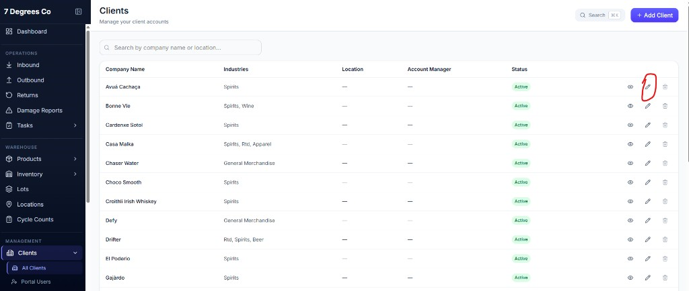
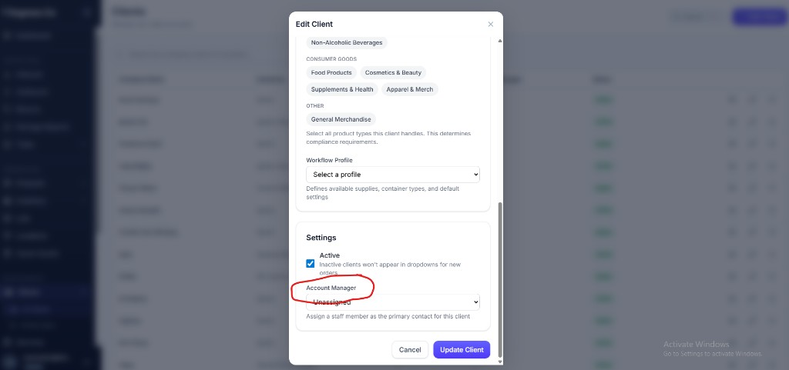
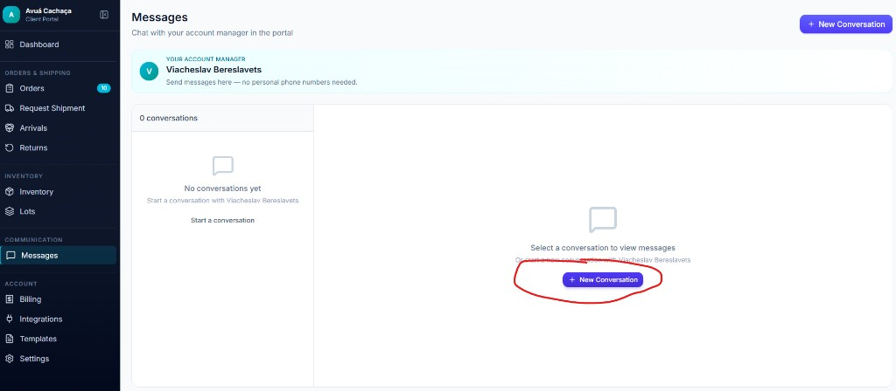
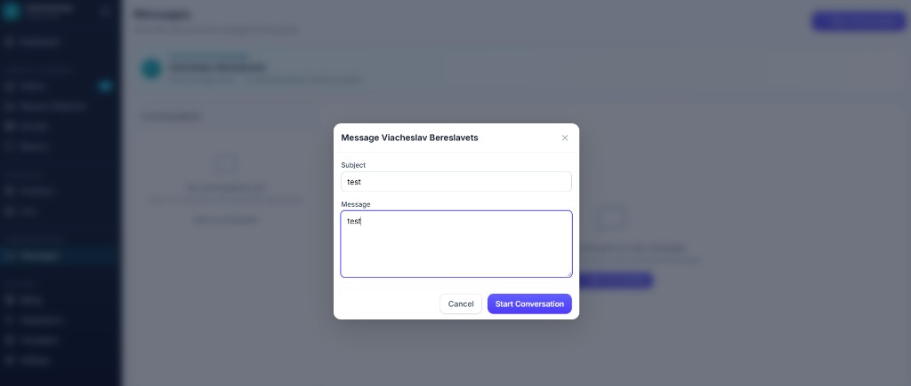
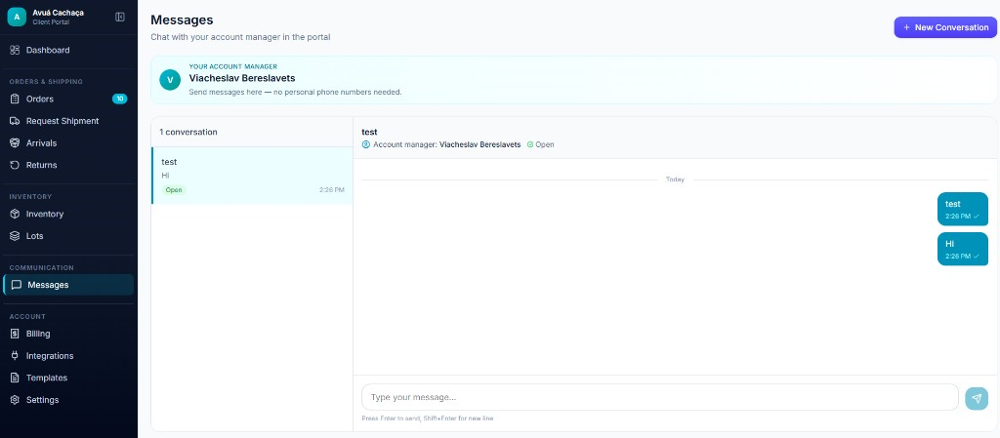
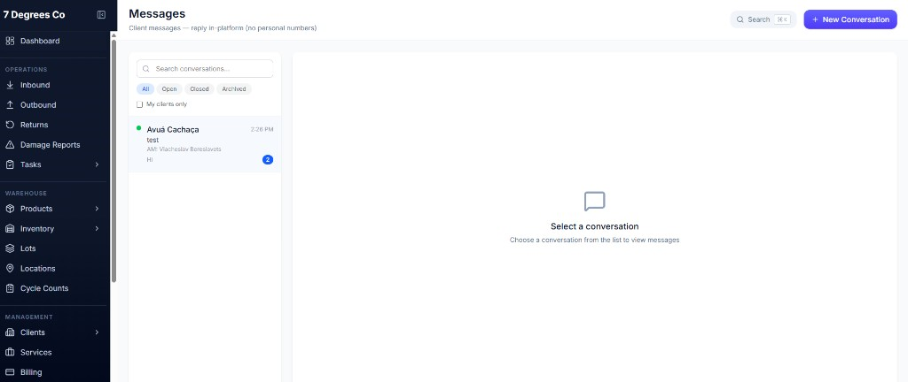
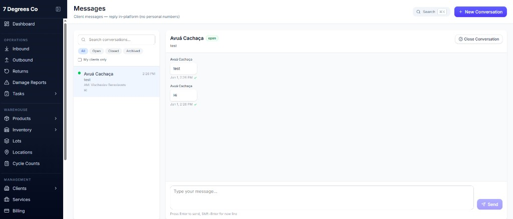

# Account Manager & In-Platform Messaging

This guide explains how to assign an **account manager** to a client and how clients and staff exchange messages **inside 7 Degrees** (no personal phone numbers).

---

## Overview

| Role | What they do |
|------|----------------|
| **Admin** | Assigns a staff member as the client’s account manager on the **Clients** page. |
| **Client (portal)** | Opens **Messages**, starts a conversation, and chats with their account manager. |
| **Staff (admin)** | Opens **Messages**, sees client threads, and replies in the platform. |

The assigned account manager’s name appears on the client **Messages** page. Staff can filter **My clients only** to focus on conversations for clients they manage.

---

## Prerequisites

- You have **admin** access to the internal dashboard.
- At least one **internal user** exists (Settings → System → Users) so they can be chosen in the Account Manager dropdown.
- The client has an active portal account (Clients → **Portal Users**).

---

## Part 1 — Assign an account manager (admin)

### Step 1 — Open All Clients

1. Sign in to the **7 Degrees admin** dashboard.
2. In the left menu, go to **Management → Clients → All Clients**.

3. Find the client and click the **Edit** (pencil) icon on that row.

### Step 2 — Select the account manager

1. In the **Edit Client** window, scroll to **Settings**.
2. Open the **Account Manager** dropdown.
3. Choose the staff member who will be the client’s primary contact (or leave **Unassigned** if not ready yet).

4. Click **Update Client** to save.

The client’s portal **Messages** page will show that person as **Your account manager** once assigned.

---

## Part 2 — Client sends a message (portal)

### Step 1 — Open Messages

1. The client signs in to the **Client Portal**.
2. In the left menu, under **Communication**, click **Messages**.

The page shows the account manager’s name and explains that messaging stays in the portal.

### Step 2 — Start a conversation

1. Click **+ New Conversation** (top right or in the empty state).
2. Enter a **Subject** and **Message**.
3. Click **Start Conversation**.

The modal title uses the account manager’s name (for example, **Message Viacheslav Bereslavets**).

### Step 3 — Send messages

1. Select the conversation in the list on the left.
2. Type in **Type your message…** at the bottom.
3. Press **Enter** or click the send button.

Messages appear in the thread with timestamps. The client can start additional conversations with different subjects if needed.

---

## Part 3 — Staff views and replies (admin)

### Step 1 — Open Messages

1. Sign in to the **admin** dashboard.
2. In the left menu, click **Messages** (under **Other**).

Subtitle: *Client messages — reply in-platform (no personal numbers)*.

### Step 2 — Find the client’s conversation

1. Use **Search conversations…** if needed.
2. Optionally check **My clients only** to show only clients where you are the assigned account manager.
3. Each row shows the **client name**, **subject**, preview, and **AM:** (account manager name). Unread client messages show a badge count.

4. Click the conversation to open it.

### Step 3 — Reply

1. Read the client’s messages in the thread.
2. Type your reply in **Type your message…**
3. Click **Send** (or press Enter).

Opening the conversation marks the client’s messages as read. The unread badge on **Messages** in the sidebar updates accordingly.

You can **Close Conversation** when the topic is finished. The client can still start a new conversation later.

---

## Quick reference

| Task | Where | Path |
|------|--------|------|
| Assign account manager | Admin | **Clients → All Clients → Edit → Account Manager → Update Client** |
| Client starts chat | Portal | **Messages → + New Conversation** |
| Client sends message | Portal | Select thread → type message → Send |
| Staff reads/replies | Admin | **Messages → select client → Send** |
| Filter by your clients | Admin | **Messages → My clients only** |

---

## Notes

- **No phone numbers** — All communication happens in the portal; clients are not asked to use personal numbers.
- **Email (optional)** — If email is configured (`RESEND_API_KEY`), the account manager may receive an email when a client sends a new message. The account is still created even if that email fails.
- **Unassigned manager** — If no account manager is set, the portal still allows messaging the 7 Degrees team; the account manager banner is hidden until someone is assigned.
- **Portal users** — Manage who can sign in under **Clients → Portal Users**. Manage internal staff under **Settings → System**.
