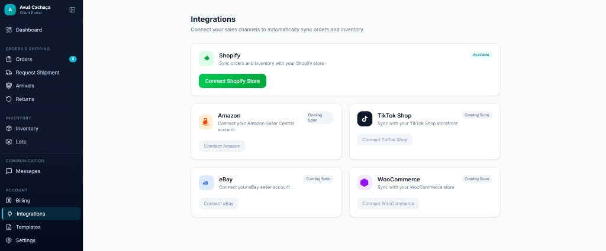
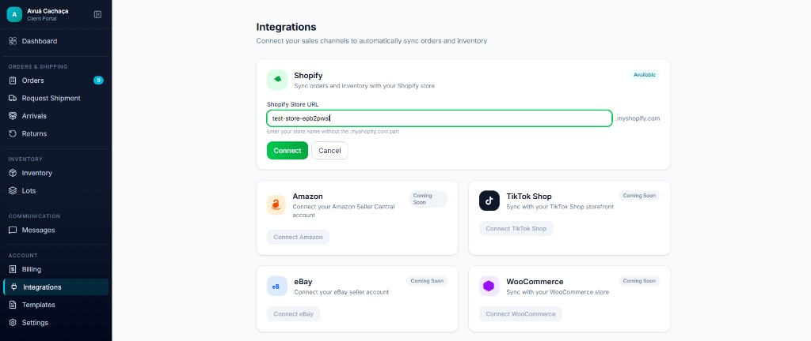
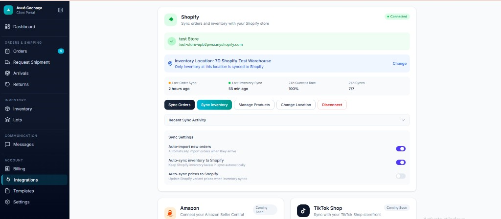
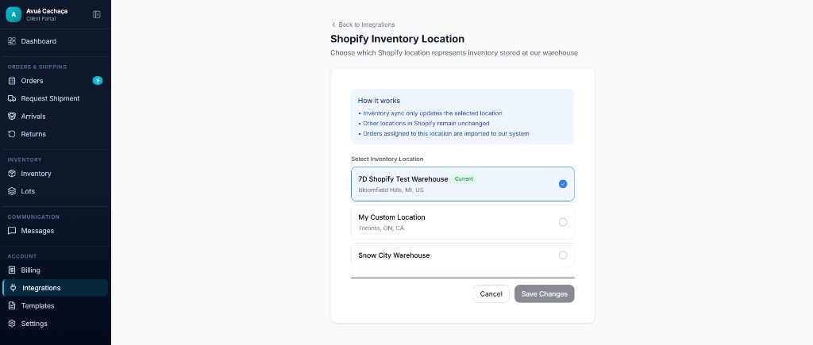
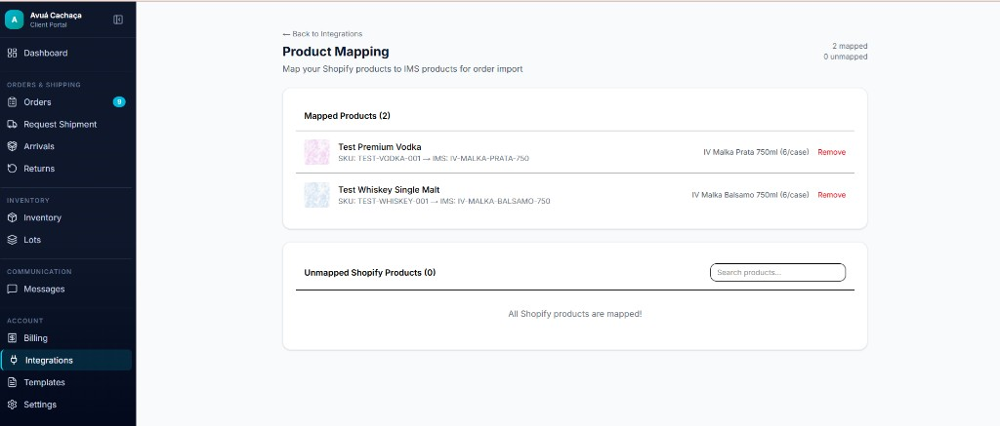

# How to Invite a Portal User and Connect Shopify to 7D

This guide covers the full client onboarding flow: invite a portal user, confirm the invitation email, install the Shopify app on the client's store, and connect Shopify in the **7D Client Portal**.

---

## Step 1 — Invite the portal user

Before a client can connect Shopify, a **portal user** must be invited for their account.

1. Sign in to the **7D admin dashboard**.
2. Go to **Management** → **Clients** → **Portal Users**.
3. Click **+ Add User**.
4. Select the **Send Invite** tab.
5. Enter the user's **email**, **full name**, and other contact details.
6. Under **Assign to Client**, choose the correct client (for example **Hapa**).
7. Under **Role**, choose **Owner - Full access and billing** (or the appropriate role for that user).
8. Click **Save & Send Invitation**.


---

## Step 2 — Confirm the invitation email was sent

After sending the invite, the form should show a success message:

> **Invitation sent!** They will receive an email to set up their account.


Ask the client to check their inbox (and spam/junk folder) for the invitation email. They will use that link to create a password and sign in to the **Client Portal**.

If the email does not arrive, confirm the address is correct and resend the invitation from **Portal Users**.

---

## Step 3 — Install the Shopify app on the client's store

The client must install the **7D Shopify app** on their Shopify store before connecting in the portal. Use the install link provided by 7 Degrees Co, or the public Shopify app listing when it is available.

### Example: Hapa

**Shopify store name:** `rpujsi-ji` (the part before `.myshopify.com`)

**Install link for Hapa:**

```
https://admin.shopify.com/?redirect=%2Foauth%2Finstall_custom_app%3Fclient_id%3D52eed85544fe093de458828137f3e381%26no_redirect%3Dtrue%26signature%3DeyJleHBpcmVzX2F0IjoxNzgzMDg4ODk0LCJwZXJtYW5lbnRfZG9tYWluIjoicnB1anNpLWppLm15c2hvcGlmeS5jb20iLCJjbGllbnRfaWQiOiI1MmVlZDg1NTQ0ZmUwOTNkZTQ1ODgyODEzN2YzZTM4MSIsInB1cnBvc2UiOiJjdXN0b21fYXBwIiwibWVyY2hhbnRfb3JnYW5pemF0aW9uX2lkIjoxNjkwNjA5MDd9--7a452f9ec237d3f22cab53cdcb72542bb0f8a240&no_redirect=true
```

Steps for the client:

1. Open the install link above (or the link 7 Degrees provides for their store).
2. Sign in to their Shopify admin if prompted.
3. Review the app permissions and click **Install** or **Approve**.
4. Confirm the app appears as installed on their Shopify store.

---

## Step 4 — Open Integrations in the Client Portal

1. The client signs in to the **7D Client Portal** using the invitation email.
2. In the left menu, under **Account**, click **Integrations**.



3. On the **Shopify** card, click the green **Connect Shopify Store** button.

---

## Step 5 — Enter your Shopify store name

1. In **Shopify Store URL**, type only the store name (the part before `.myshopify.com`).

   Example for Hapa: enter **`rpujsi-ji`**.

2. Click **Connect**.



3. Shopify opens and asks you to approve the 7D app for your store. Review the permissions and click **Install** or **Approve**.

4. You are returned to the portal. You should see a success message and the Shopify card shows **Connected**.

---

## Step 6 — Confirm the connection

After connecting, the Shopify card shows your store name and domain, and buttons to manage the link.



---

## Step 7 — Choose the Shopify inventory location

1. Click **Change Location** (or **Change** next to the inventory location).
2. Select the Shopify location that represents stock held at the 7D warehouse (for example **7D Shopify Test Warehouse**).
3. Click **Save Changes**.



---

## Step 8 — Map your products

1. From the connected Shopify card, click **Manage Products**.
2. For each Shopify product, choose the matching **7D (IMS) product** and save the mapping.
3. Map every product you expect on Shopify orders so line items import correctly.



When all products show as mapped, setup is complete.

---

## Need help?

Contact your **7 Degrees Co** account team if the invitation email does not arrive, the Shopify app install fails, or your store does not show as **Connected**.
